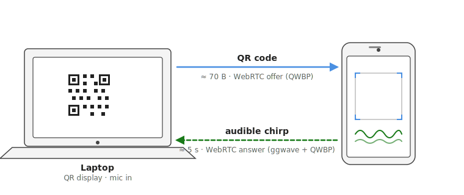

# WebRTC Out-of-Band Pairing — Reproducibility Artifact

[](https://www.python.org/)
[](LICENSE)
[](https://www.docker.com/)
[](https://webrtc.org/)
[](https://sigmahq.io/)
[](#reproducing-the-scenarios)



*Out-of-band signaling: the workstation renders the WebRTC offer as a QR code; the phone answers over an audible chirp. No external signaling server is involved.*

## Overview

This repository is the reproducibility artifact for a defensive-security study of an **out-of-band signaling technique** that establishes a WebRTC DataChannel between two co-present devices — a workstation and a smartphone — using a visual (QR) channel in one direction and an acoustic channel in the other. The study characterises the resulting enterprise egress surface, ships a deployable detection signature (a [Sigma](https://sigmahq.io/) rule), and presents a mitigation taxonomy with deployment-cost ratings.

Everything needed to re-run the experiments and re-derive the reported numbers is included: the reference implementation, the Docker testbed, the per-scenario measurement data under [`evidence/`](evidence/), and the detection rule under [`sigma/`](sigma/). The artifact accompanies a paper under submission to Elsevier *Computers & Security*.

> **Scope and intent.** This is defensive-security research, built entirely from public, intended-purpose browser APIs and existing open-source components. It is **not** a browser vulnerability and there is nothing to patch — the countermeasures are deployment-side and are documented below. Released for defensive research, security education, and reproducible evaluation; **not** as an exfiltration tool.

## ▶ Try the pairing — in your browser, no install

The quickest way to see the mechanism is the **live demo** on GitHub Pages,
served over HTTPS so there is no certificate or local server to set up. You
need a laptop **and** a phone on the same Wi-Fi:

### [▶ Open the live demo →](https://vbocan.github.io/webrtc-oob-pairing/simple-poc/)

1. **Laptop:** open the link, pick a microphone, and click **Start pairing** — a QR code appears.
2. **Phone:** open the same link, choose the **phone** role, tap **Start scanner** (grant the camera), and aim it at the laptop's QR code.
3. The phone plays a brief chirp; within ~10 seconds both screens show **Connected**.
4. Click any of the five sample photos on the laptop to send it to the phone — peer-to-peer, with no server in the path.

> **What this shows — and what it doesn't.** This is a *benign mechanism demonstration*: it pairs **two of your own devices** and transfers only **public-domain sample images** (or a file you choose), never real data. It reproduces the QR + acoustic + WebRTC **bootstrap**. The paper's *findings* — invisibility to a TLS-intercepting proxy, establishment with external DNS sinkholed, the Sigma detection rate, and the mitigations — are reproduced separately via [`autorunner/`](autorunner/) and [`testbed/`](testbed/), with the recorded data under [`evidence/`](evidence/).

If the two devices cannot reach each other on the LAN, the DataChannel never forms — which is exactly the **Wi-Fi client isolation** mitigation (M1) from the paper. The demo uses only standard browser APIs, and the microphone and camera are granted in your own browser session.

> **Prefer to run it locally?** See the [Quick Start](#quick-start) below (`simple-poc/` over an HTTPS dev server).

## Repository Layout

```
.
├── README.md          this file — the single source of operational knowledge
├── LICENSE            MIT
├── banner.svg
│
├── simple-poc/        polished demonstration build (full UI; for the walkthrough)
├── autorunner/        instrumented measurement build (JSONL logs + analyzer);
│                      analysis/analyze.py reduces a run to per-iteration metrics;
│                      third-party libs vendored under autorunner/vendor/ (self-contained)
├── testbed/           Docker rigs (see testbed/README.md): tls-proxy/
│                      (mitmproxy for E1) and m2-browser-policy/
│                      (a throwaway Dockerized Firefox)
│
├── sigma/             detection rule + evaluation (read these directly):
│   ├── rule.yml            the Sigma rule (2 base rules + temporal correlation)
│   ├── allowlist.yml       sanctioned VoIP origins (the one operator-tuned knob)
│   ├── telemetry-pipeline.md   what must be logged, and which sources supply it
│   ├── evaluation.md       detection rate (25/25) + structural false-positive argument
│   └── *.py                projection + reference-matcher scripts
│
└── evidence/          captured measurement data, one folder per scenario; each holds
    │                  the raw JSONL from both devices, per-iter.csv, and conditions.md
    │                  (exact hardware/network/version/result for that run)
    ├── baseline/          B1 — open-LAN baseline (10/10 paired)
    ├── throughput/        B2 — DataChannel goodput sweep   (+ throughput-rerun/)
    ├── tls-proxy/         E1 — establishes through a TLS-intercepting proxy (10/10)
    │                          + proxy-evidence.md (curated mitmproxy flows)
    ├── dns-denied/        E2 — establishes with all external DNS denied (5/5)
    ├── wifi-isolation/    M1 — blocked when no LAN path exists (0/5)
    │                          + FAILED-same-subnet.md (why a guest-net toggle is not enough)
    ├── browser-policy/    M2 — blocked when WebRTC disabled by policy (0/5)
    └── sigma-telemetry/   webrtc-internals dump for the detection-rate measurement
```

## Quick Start

### Demo (for the walkthrough / screenshots)

```sh
cd simple-poc && pip install cryptography && python make_cert.py && python serve.py
```

Open the workstation URL it prints (`laptop.html`) and the phone URL (`phone.html`) on a co-present phone; scan the QR, let the phone chirp back, and the DataChannel forms. This build keeps the connection open and has no measurement scaffolding.

### Measurement build (produces the `evidence/` data)

```sh
cd autorunner && pip install -r requirements.txt && python make_cert.py && python serve.py
```

Then:

1. **Phone** — open the printed LAN URL (`phone.html`), Measurement mode → **Auto-rescan** ✓ → **Start scanner**.
2. **Workstation** — open `https://localhost:8000/laptop.html`, pick the mic, set **Iterations** and **Test file(s)** (a comma list sweeps sizes, e.g. `100,1024,10240` KB), click **Run**. The runner does N unattended pairings, re-pairing each time.
3. **Download log** on both pages → save into `evidence/<scenario>/` as `laptop.jsonl` / `phone.jsonl`.

The pages emit a structured JSONL event log on both sides (`session_start`, `pairing_start`, `offer_created`, `qr_rendered`, `mic_listening`, `audio_frame_decoded`, `ice_connected`, `datachannel_open`, `transfer_*`), version-tagged in every `session_start`.

### Analyze a run

```sh
cd autorunner/analysis
python analyze.py ../../evidence/<scenario>/laptop.jsonl \
                  ../../evidence/<scenario>/phone.jsonl \
                  --scenario <ID> --csv ../../evidence/<scenario>/per-iter.csv
```

Prints a per-iteration table, summary statistics, and (for size sweeps) a throughput-by-payload table; writes `per-iter.csv`.

## Reproducing the Scenarios

All scenarios use the measurement build above; only the *condition* and the expected *outcome* differ. Exact run conditions and results are in each folder's `conditions.md`.

Scenario codes group by outcome class: **B** = baseline/characterization, **E** = egress surface demonstrated (a control is present, pairing still succeeds), **M** = mitigation effective (pairing is blocked).

| Scenario (folder) | Condition imposed | How | Result |
|---|---|---|---|
| **B1** `baseline/` | none (open LAN, defaults) | run as-is, N=10 @ 100 kB | 10/10 paired |
| **B2** `throughput/` (+ `-rerun/`) | none; sweep payload sizes | Test file(s) = `100,1024,10240`, N=10 each | ~6–7 MB/s steady state |
| **E1** `tls-proxy/` | TLS-intercepting proxy in front of the workstation | mitmproxy in Docker (`testbed/tls-proxy`); launch a throwaway browser with `--proxy-server=127.0.0.1:8080 --ignore-certificate-errors` | 10/10 **through** the proxy; **0** flows to the peer (`proxy-evidence.md`) |
| **E2** `dns-denied/` | workstation browser cannot resolve any external name | serve from Docker (`autorunner`); launch a throwaway browser with `--host-resolver-rules="MAP * ~NOTFOUND, EXCLUDE localhost"`; confirm `example.com` fails | 5/5 paired with DNS denied (host↔host, no name resolved) |
| **M1** `wifi-isolation/` | phone has **no LAN path** to the workstation | put the phone on a network with no route to any workstation IP (cellular, or true AP/station isolation, or a separate firewalled subnet). **First verify** the workstation page is unreachable from the phone | 0/5 — bootstrap succeeds, ICE finds no pair |
| **M2** `browser-policy/` | WebRTC disabled by managed-browser policy | throwaway Dockerized Firefox with `media.peerconnection.enabled=false` locked (`testbed/m2-browser-policy/`) | 0/5 — `RTCPeerConnection` construction refused |

Notes that matter for faithful reproduction:

- **M1:** a consumer "guest network + block-local-access" toggle does **not** isolate if the guest SSID is bridged to the workstation's subnet — the channel establishes normally. Use true station isolation or a separate subnet. See `evidence/wifi-isolation/FAILED-same-subnet.md`.
- **E2/M2** need no live phone interaction beyond a normal pairing: E2 is a normal pairing with DNS denied; M2 fails at offer creation before the mic or phone are involved, so it runs headless in the container.
- The vendored libraries (`autorunner/vendor/`) let the pages load with zero external DNS, which is what makes the E2 browser-flag method clean.

## The Detection Rule

A browser process that acquires the microphone (`getUserMedia(audio)`) and, within two minutes, opens an `RTCDataChannel` on an origin **not** in the corporate VoIP allowlist — a conjunction that legitimate video calls (media tracks on allowlisted origins) do not produce. Logic lives in [`sigma/rule.yml`](sigma/rule.yml), the allowlist in [`sigma/allowlist.yml`](sigma/allowlist.yml), and the telemetry it needs (and which sources supply it) in [`sigma/telemetry-pipeline.md`](sigma/telemetry-pipeline.md).

Re-derive the measured detection rate (**25/25 pairings, 100%**) from the committed data:

```sh
cd sigma
python jsonl_to_webrtc_api.py \
  ../evidence/baseline/qr-webrtc-laptop-*.jsonl \
  ../evidence/tls-proxy/qr-webrtc-laptop-*.jsonl \
  ../evidence/dns-denied/laptop.jsonl | python match_correlation.py
```

[`sigma/evaluation.md`](sigma/evaluation.md) reports the result and the structural false-positive argument. `match_correlation.py` is a stdlib reference implementation of the rule's temporal correlation, so the number reproduces without a Sigma backend.

## Key Results

- The DataChannel establishes through a **TLS-intercepting proxy** and through **denied DNS**, and moves megabytes within the co-presence window.
- It is **stopped** by Wi-Fi client isolation (no LAN path) and by a browser policy disabling WebRTC — the two recommended mitigations.
- The Sigma rule fires on **25/25** captured pairings (100% detection rate).

## Citation

If you use this artifact in your research, please cite:

```bibtex
@misc{bocan2026webrtcoob,
  title        = {WebRTC Out-of-Band Pairing: Reproducibility Artifact},
  author       = {Bocan, Valer},
  year         = {2026},
  howpublished = {\url{https://github.com/vbocan/webrtc-oob-pairing}},
  note         = {Artifact accompanying a paper under submission to
                  Elsevier Computers \& Security}
}
```

The corresponding paper citation will be added here on acceptance.

## License

Code and data are licensed under the **MIT License** — see [`LICENSE`](LICENSE). The accompanying paper text and figures are licensed separately (CC-BY at publication).

## Author & Contact

**Author**: Valer Bocan, PhD, CSSLP
**Affiliation**: Department of Computer and Information Technology, Politehnica University of Timișoara

- **Issues**: Report problems or questions via [GitHub Issues](https://github.com/vbocan/webrtc-oob-pairing/issues)
- **Email**: valer.bocan@upt.ro
